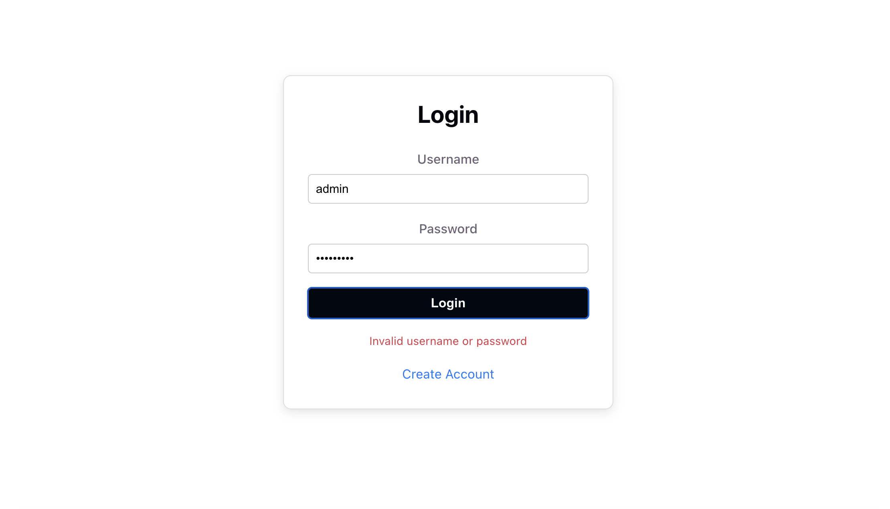
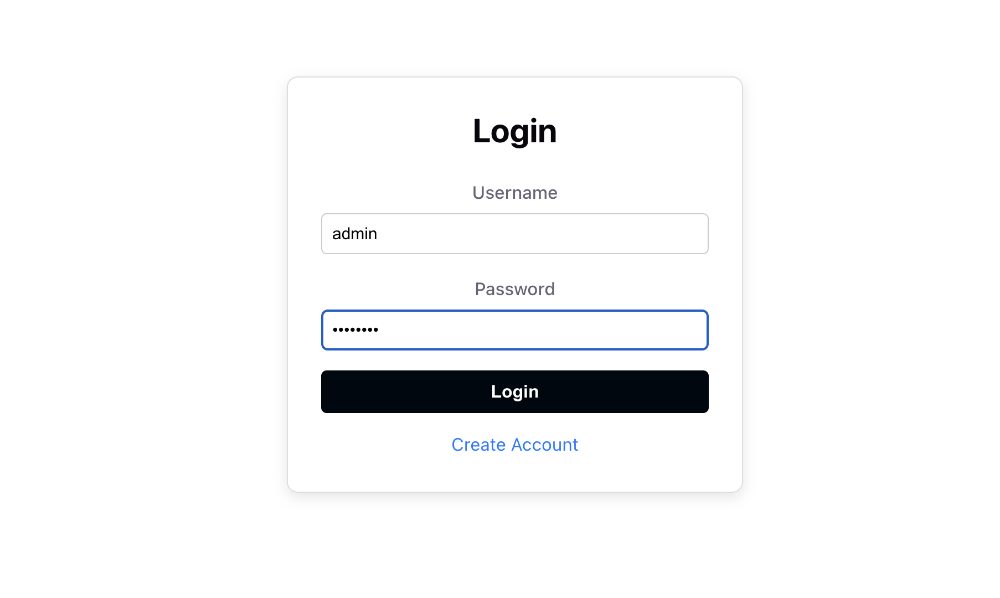
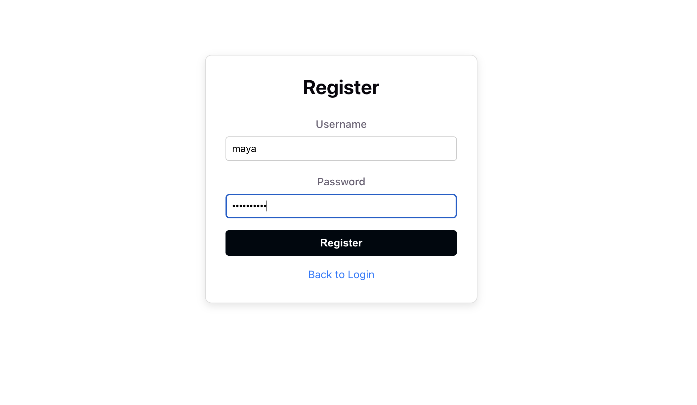
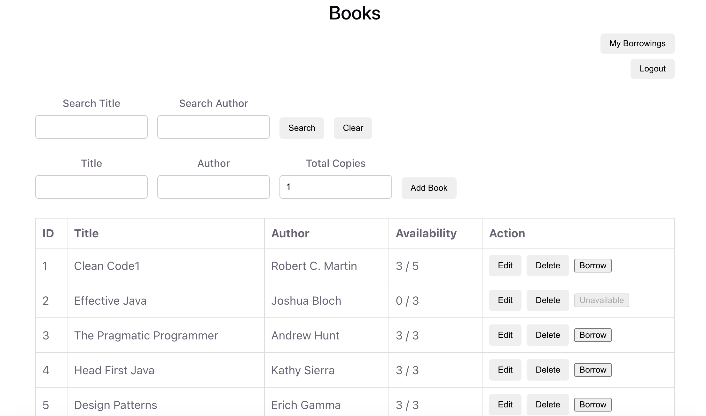
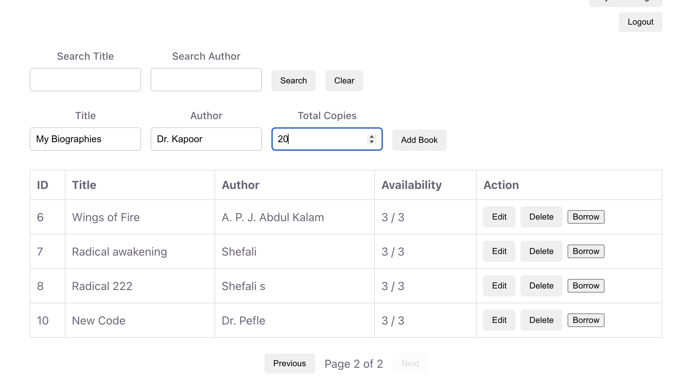
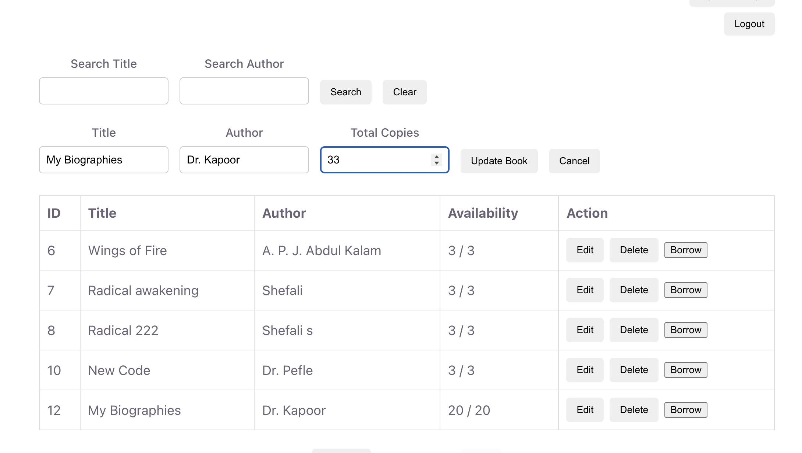
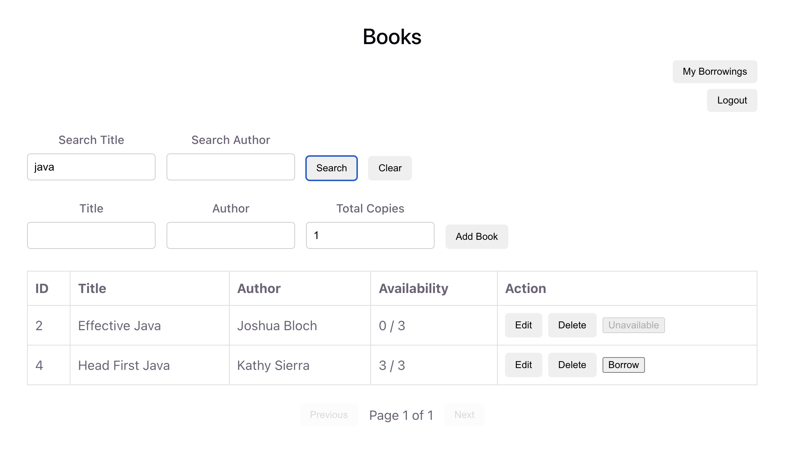
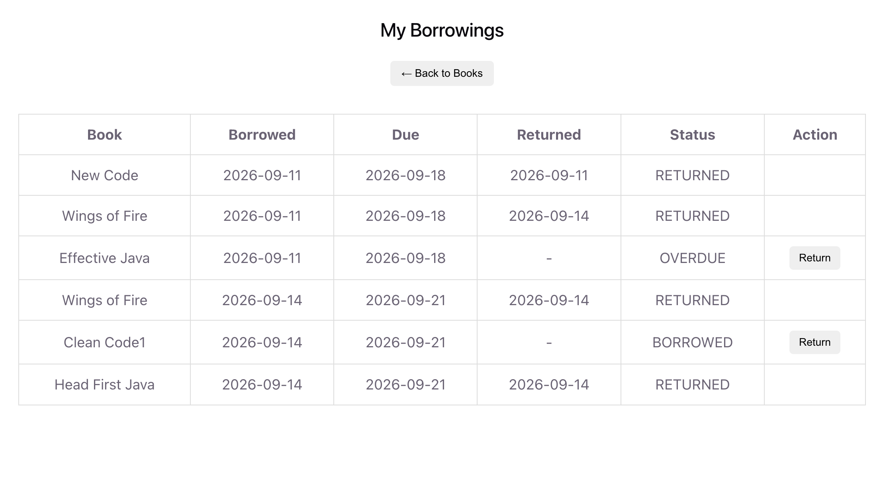
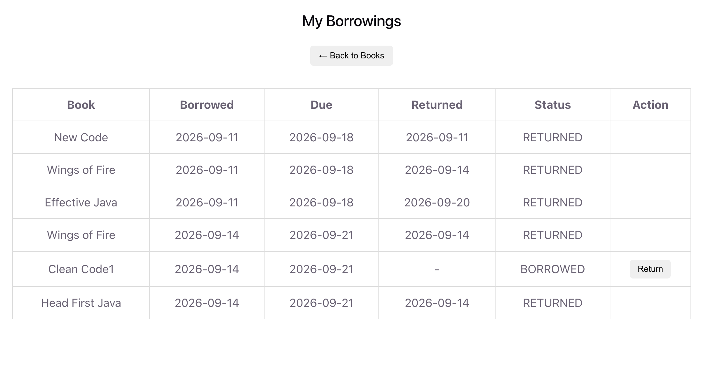
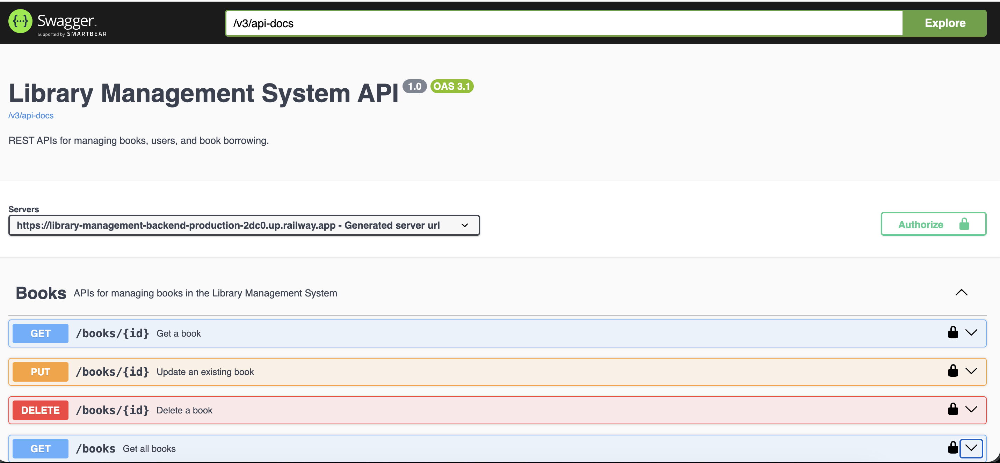

# Library Management System

A full-stack Library Management System built with Spring Boot and React.

The application provides REST APIs for managing books, user authentication,
role-based authorization, book borrowing and returning, search, pagination,
sorting, and inventory tracking.

The backend is built with Spring Boot and deployed on Railway, while the
React frontend is deployed on Vercel.

## Live Demo

- **Frontend:** https://library-management-frontend-swart-seven.vercel.app/login
- **Backend API:** https://library-management-backend-production-2dc0.up.railway.app/auth/login

- **Swagger API Documentation:** https://library-management-backend-production-2dc0.up.railway.app/swagger-ui/index.html

## Demo Credentials

### Admin

- Username: `admin`
- Password: `admin123`

Admin users can manage books, including adding, updating, deleting books, borrow available books, return borrowed books,
and view their borrowing history.

### User

- Username: `john`
- Password: `john123`

Regular users can browse books, borrow available books, return borrowed books,
and view their borrowing history.

## Features

### Authentication & Authorization

- User registration and login
- JWT-based authentication
- BCrypt password hashing
- Role-based authorization
- Admin and User roles
- Protected REST endpoints
- Custom `401 Unauthorized` and `403 Forbidden` responses

### Book Management

- Add books
- View books
- View a book by ID
- Update book details
- Delete books
- Track total and available copies

### Search & Pagination

- Search books by title
- Search books by author
- Search by title and author together
- Pagination
- Sorting by supported fields
- Ascending and descending sorting
- Validation of sorting fields

### Borrowing Management

- Borrow available books
- Admin and User borrowing support
- Prevent borrowing when no copies are available
- Prevent a user from borrowing the same book twice
- Return borrowed books
- Prevent duplicate returns
- View personal borrowing history
- Detect overdue books
- Automatically update book availability
- Track total and available book copies

### Validation & Error Handling

- Request validation using Jakarta Bean Validation
- Global exception handling
- Structured error responses
- Meaningful HTTP status codes
- Custom business exceptions

## Tech Stack

### Backend

- Java 21
- Spring Boot
- Spring Web
- Spring Data JPA
- Hibernate
- Spring Security
- JWT
- Jakarta Bean Validation
- Maven
- MySQL

### Frontend

- React
- React Router
- Vite
- JavaScript
- CSS

### Deployment & Tools

- Docker
- Railway
- Vercel
- Swagger / OpenAPI
- Git
- GitHub

## Architecture & Application Flow

The application follows a client-server architecture:

```text
                    ┌──────────────────────┐
                    │    React Frontend    │
                    │      (Vercel)        │
                    └──────────┬───────────┘
                               │
                         HTTP / REST API
                               │
                               ▼
                    ┌──────────────────────┐
                    │   Spring Boot API    │
                    │      (Railway)       │
                    └──────────┬───────────┘
                               │
                ┌──────────────┼──────────────┐
                │              │              │
                ▼              ▼              ▼
        ┌─────────────┐ ┌─────────────┐ ┌─────────────┐
        │  Security   │ │  Services   │ │ Controllers │
        │ JWT + RBAC  │ │ Business    │ │ REST APIs   │
        │             │ │ Logic       │ │             │
        └─────────────┘ └──────┬──────┘ └─────────────┘
                               │
                               ▼
                    ┌──────────────────────┐
                    │ Spring Data JPA /    │
                    │     Hibernate        │
                    └──────────┬───────────┘
                               │
                               ▼
                    ┌──────────────────────┐
                    │    MySQL Database    │
                    └──────────────────────┘
```

### Request Flow

1. The user interacts with the React frontend.
2. The frontend sends HTTP requests to the Spring Boot REST API.
3. The JWT token is sent with authenticated requests.
4. `JwtAuthenticationFilter` validates the token and identifies the user.
5. Spring Security checks the user's role and endpoint permissions.
6. Controllers receive the request and delegate business logic to service classes.
7. Services interact with the database through Spring Data JPA repositories.
8. The API returns the response to the React frontend.

### Borrowing Flow

```text
User requests to borrow a book
              ↓
      Check authentication
              ↓
       Find user and book
              ↓
   Check existing borrowing
              ↓
    Check available copies
              ↓
   Create borrowing record
              ↓
 Decrease available copies
              ↓
       Return response


```
### Return Flow

```text
User requests to return a book
              ↓
      Find borrowing record
              ↓
       Check return status
              ↓
       Verify ownership
              ↓
      Mark borrowing returned
              ↓
  Increase available copies
              ↓
       Return response
```

### Book Copy Management

The system maintains two inventory values for each book:

- `totalCopies` — total number of physical copies owned by the library.
- `availableCopies` — copies that are currently available for borrowing.

`availableCopies` is managed by the system and cannot be directly edited.

When a book is borrowed:

```text
availableCopies = availableCopies - 1
```
When a book is returned:

```text
availableCopies = availableCopies + 1
```


### Borrowing Rules

Then:

```
### Borrowing Rules

- A user cannot borrow a book when no copies are available.
- A user cannot borrow the same book while they already have an active borrowing.
- Only the user who created a borrowing can return it.
- A returned borrowing cannot be returned again.
- Borrowing and return operations automatically update book availability.
- Borrowings include a due date and overdue status.
```
### Role-Based Access

| Operation | Admin | User |
|-----------|:-----:|:----:|
| Browse books | ✓ | ✓ |
| Search books | ✓ | ✓ |
| Borrow books | ✓ | ✓ |
| Return books | ✓ | ✓ |
| View own borrowing history | ✓ | ✓ |
| Add books | ✓ | ✗ |
| Update books | ✓ | ✗ |
| Delete books | ✓ | ✗ |

Administrators have full book-management permissions in addition to
the normal borrowing functionality.

Regular users can browse, search, borrow, return, and view their own
borrowing history, but cannot modify the book catalog.

## Security

The application uses Spring Security and JWT-based authentication to secure
the REST API.

### Authentication

- Users authenticate using username and password.
- Passwords are securely hashed using BCrypt.
- Successful login generates a JWT token.
- The JWT token is sent with subsequent authenticated API requests.
- `JwtAuthenticationFilter` validates the token and identifies the user.

### Authorization

Role-based access control is implemented using two roles:

- `ADMIN` — full book-management access plus normal borrowing functionality.
- `USER` — can browse, search, borrow, return, and view personal borrowing history.

Protected endpoints require a valid JWT token.

Unauthorized and forbidden requests return appropriate HTTP responses:

- `401 Unauthorized` — authentication is missing or invalid.
- `403 Forbidden` — the user is authenticated but does not have permission
  to perform the requested operation.

### Password Security

User passwords are never stored as plain text. BCrypt is used to securely
hash passwords before they are stored in the database.

### JWT Flow

```text
Login Request
     ↓
Username + Password
     ↓
Spring Security Authentication
     ↓
Validate Credentials
     ↓
Generate JWT Token
     ↓
Client Stores Token
     ↓
Token Sent with API Requests
     ↓
JwtAuthenticationFilter
     ↓
Validate JWT
     ↓
Check User Role
     ↓
Allow / Reject Request
```

## API Documentation

The backend API is documented using Swagger UI and OpenAPI.

The deployed Swagger documentation provides an interactive interface for
viewing and testing the available REST endpoints.

**Swagger UI:**  
https://library-management-backend-production-2dc0.up.railway.app/swagger-ui/index.html

### Main API Areas

| Area | Description |
|------|-------------|
| Authentication | User registration and login |
| Books | Create, read, update, delete, search, pagination, and sorting |
| Borrowings | Borrow, return, and view personal borrowing history |

The API uses JWT Bearer authentication for protected endpoints.

To test protected endpoints in Swagger:

1. Login using the `/auth/login` endpoint.
2. Copy the returned JWT token.
3. Use the **Authorize** button in Swagger UI.
4. Enter the token using the Bearer authentication scheme.
5. Execute the protected endpoints.

> The Swagger UI is intended for API exploration and testing. The deployed
> frontend provides the complete user-facing application experience.

## Database Design

The application uses MySQL with Spring Data JPA and Hibernate for
database persistence.

### Main Entities

| Entity | Purpose |
|--------|---------|
| User | Stores registered users, credentials, and roles |
| Book | Stores book details and copy availability |
| Borrowing | Stores book borrowing and return records |

### Entity Relationships

```text
User
 │
 │ 1
 │
 │
 │ *
 ▼
Borrowing
 │
 │ *
 │
 │ 1
 ▼
Book
```

A user can have multiple borrowing records.
A book can appear in multiple borrowing records over time.
Each borrowing record belongs to one user and one book.

## Project Structure

The backend follows a layered architecture to separate API handling,
business logic, data access, and security concerns.

```text
src/main/java/com/example/library_management/
│
├── advice
│   ├── GlobalExceptionHandler
│
├── config/
│   ├── SecurityConfig
│   └── ...
│
├── controller/
│   ├── AuthController
│   ├── BookController
│   └── BorrowingController
│
├── dto/
│   ├── request/
│   └── response/
│
├── entity/
│   ├── User
│   ├── Book
│   └── Borrowing
│
├── exception/
│   ├── AlreadyReturnedException
│   ├── BookAlreadyBorrowedException
│   ├── BookNotFoundException
│   ├── UsernameAlreadyExistsException
│   └── ...
│
├── repository/
│   ├── UserRepository
│   ├── BookRepository
│   └── BorrowingRepository
│
├── security/
│   ├── JwtAuthenticationFilter
│   └── ...
│
├── service/
│   ├── BookService
│   ├── BorrowingService
│   ├── JwtService
│   └── ...
│
└── LibraryManagementApplication
```

### Layer Responsibilities

1. Controller — Handles HTTP requests and responses.
2. Service — Contains business logic and application rules.
3. Repository — Handles database access through Spring Data JPA.
4. Entity — Represents database tables and relationships.
5. DTO — Defines the request and response data exposed by the API.
6. Security — Handles JWT authentication and authorization.
7. Exception — Provides custome exception classes according to the business logics.
8. Advice — Provides centralized exception handling and structured error responses.
9. Config — Contains application and security configuration.

## Screenshots

### Login




### Register



### Books



### Add / Edit / Search Book





### My Borrowings




### Swagger API Documentation


